# AWS Secure Multi-Tier Webapp Portfolio Project

## HR-Friendly Summary (5 Lines)
*   **What it is:** A production-grade, highly available, secure multi-tier web application architecture defined in Terraform.
*   **Business Value:** Demonstrates how to run web applications safely with zero direct internet exposure to compute or database layers.
*   **Key Tech:** Provisions VPC networking, Application Load Balancing (ALB), Auto Scaling EC2 instances, and Multi-AZ RDS MySQL.
*   **Security Posture:** Integrates strict least-privilege security groups, IAM instance profiles, and data encryption at rest and in transit.
*   **Target Level:** Matches the strict resilience, security, and operational standards of the AWS SAP-C02 Professional exam.

---

## Technical Summary
This repository showcases an Infrastructure as Code (IaC) implementation of a classic three-tier web application architecture on AWS. It implements high availability by distributing compute and database nodes across multiple Availability Zones (AZs) in a custom VPC. The load balancing layer is public-facing, whereas the application hosting tier and database tier are completely private, enforcing network isolation. Outbound internet connection for patching and updates is routed through NAT Gateways, while the database subnets are completely isolated from the internet.

---

## Architecture Diagram

This diagram visualizes the network isolation, traffic flow, and logical layers. (The source Mermaid file is located at [`diagrams/architecture.mmd`](diagrams/architecture.mmd)).

```mermaid
graph TD
  classDef internet fill:#f9f,stroke:#333,stroke-width:2px;
  classDef dns fill:#232F3E,stroke:#fff,stroke-width:1px,color:#fff;
  classDef alb fill:#8C4FFF,stroke:#fff,stroke-width:1px,color:#fff;
  classDef publicSubnet fill:#E6F2FF,stroke:#0073BB,stroke-width:1px,stroke-dasharray: 5 5;
  classDef privateAppSubnet fill:#FFEBF0,stroke:#D9144A,stroke-width:1px,stroke-dasharray: 5 5;
  classDef privateDbSubnet fill:#E2FFEB,stroke:#1D8102,stroke-width:1px,stroke-dasharray: 5 5;
  classDef ec2 fill:#FF9900,stroke:#333,stroke-width:1px;
  classDef rds fill:#3357FF,stroke:#333,stroke-width:1px,color:#fff;
  classDef s3 fill:#3F8624,stroke:#333,stroke-width:1px,color:#fff;
  classDef iam fill:#808080,stroke:#333,stroke-width:1px,color:#fff;
  classDef cw fill:#FF4D4D,stroke:#333,stroke-width:1px,color:#fff;

  User([Internet User]) -->|HTTPS| R53[Route 53 DNS]
  R53 -->|Resolve| ALB[Application Load Balancer]

  subgraph VPC ["AWS Virtual Private Cloud (VPC)"]
    direction TB
    
    subgraph SG_ALB ["Security Group: ALB (Ports 80, 443)"]
      ALB
    end

    subgraph AZ_A ["Availability Zone A"]
      subgraph Public_Subnet_A ["Public Subnet A"]
        ALB_A[ALB Node A]
      end
      
      subgraph Private_App_Subnet_A ["Private App Subnet A"]
        subgraph ASG ["Auto Scaling Group"]
          EC2_A[EC2 Web Instance A]
        end
      end

      subgraph Private_DB_Subnet_A ["Private DB Subnet A"]
        RDS_Pri[RDS Master DB]
      end
    end

    subgraph AZ_B ["Availability Zone B"]
      subgraph Public_Subnet_B ["Public Subnet B"]
        ALB_B[ALB Node B]
      end
      
      subgraph Private_App_Subnet_B ["Private App Subnet B"]
        EC2_B[EC2 Web Instance B]
      end

      subgraph Private_DB_Subnet_B ["Private DB Subnet B"]
        RDS_Sec[RDS Standby DB]
      end
    end

    %% Security Group boundaries
    subgraph SG_EC2 ["Security Group: EC2 Web (Accept ALB only)"]
      EC2_A
      EC2_B
    end

    subgraph SG_RDS ["Security Group: DB (Accept EC2 only)"]
      RDS_Pri
      RDS_Sec
    end

    %% NAT Gateways
    NAT_A[NAT Gateway A]
    NAT_B[NAT Gateway B]
    IGW[Internet Gateway]

    Public_Subnet_A --> NAT_A
    Public_Subnet_B --> NAT_B
    Public_Subnet_A --> IGW
    Public_Subnet_B --> IGW
    
    Private_App_Subnet_A -->|Route via NAT A| NAT_A
    Private_App_Subnet_B -->|Route via NAT B| NAT_B
  end

  %% Flow and Connections
  ALB -->|Forward Port 80| EC2_A
  ALB -->|Forward Port 80| EC2_B
  EC2_A -->|Read/Write Port 3306| RDS_Pri
  EC2_B -->|Read/Write Port 3306| RDS_Pri

  %% Auxiliary Services
  IAM_Role[IAM Instance Profile] -.->|Least Privilege Permissions| EC2_A
  IAM_Role -.->|Least Privilege Permissions| EC2_B

  EC2_A -->|Send Logs & Metrics| CW[CloudWatch Logs / Alarms]
  EC2_B -->|Send Logs & Metrics| CW

  ALB -->|Access Logs| S3[S3 Bucket - logs-and-assets]
  EC2_A -->|Upload/Download Assets| S3
  EC2_B -->|Upload/Download Assets| S3

  class User internet;
  class R53 dns;
  class ALB,ALB_A,ALB_B alb;
  class Public_Subnet_A,Public_Subnet_B publicSubnet;
  class Private_App_Subnet_A,Private_App_Subnet_B privateAppSubnet;
  class Private_DB_Subnet_A,Private_DB_Subnet_B privateDbSubnet;
  class EC2_A,EC2_B ec2;
  class RDS_Pri,RDS_Sec rds;
  class S3 s3;
  class IAM_Role iam;
  class CW cw;
```



---

## AWS Services Used

*   **VPC, Subnets, Route Tables, Internet Gateway, NAT Gateway**: For isolated networking.
*   **Application Load Balancer (ALB)**: To distribute public traffic evenly.
*   **Auto Scaling Group & Launch Templates**: For horizontal scaling and self-healing compute.
*   **RDS MySQL (Multi-AZ)**: For resilient, managed database storage.
*   **IAM Roles & Instance Profiles**: For secure, credential-less access to AWS APIs from EC2.
*   **S3 (Simple Storage Service)**: For encrypted access logging and static assets.
*   **CloudWatch Logs & Metric Alarms**: For continuous operational monitoring.
*   **Route 53**: For domain name resolution and routing configurations.

---

## What This Proves for SAP-C02 (AWS Certified Solutions Architect Professional)

This architecture addresses multiple complex competencies tested in the SAP-C02:
1.  **Design for Organizational Complexity**: Enforces network routing rules that isolate database layers from public internet access.
2.  **Design for New Solutions**: Implements a modular VPC subnet mapping strategy designed to prevent IP exhaustion and ensure multi-AZ redundancy.
3.  **High Availability & Business Continuity**: Configures Multi-AZ RDS and ELB health checks coupled with ASG policies to tolerate availability zone outages.
4.  **Security Threat Assessment**: Demonstrates network-level least-privilege security groups and secure IAM role segregation (avoiding hardcoded access keys).
5.  **Cost Optimization**: Implements standard high availability but documents low-cost NAT alternatives for test/lab environments.

---

## Repository Structure

```
secure-multi-tier-webapp/
  ├── README.md                 # Project Overview (This file)
  ├── architecture.md           # Deep architectural analysis & Well-Architected Framework
  ├── deployment-guide.md       # Safe installation and teardown instructions
  ├── security-controls.md      # Review of security boundaries, IAM, and hardening
  ├── cost-analysis.md          # Project cost breakdown and low-cost lab guide
  ├── operations-runbook.md     # Runbook for operations, backups, and scaling
  ├── failure-scenarios.md      # Actionable failure recovery plans (DR)
  ├── interview-explanation.md  # 15 mock interview questions & detailed answers
  ├── linkedin-post.md          # Professional social announcement template
  ├── cv-bullets.md             # Resume bullets tailored for various roles
  ├── validation-report.md      # Summary of static analysis & validation checks
  ├── .gitignore                # Excludes state files, cache, and passwords
  ├── LICENSE                   # MIT License
  ├── diagrams/
  │   └── architecture.mmd      # Source file for Mermaid flow diagram
  ├── iac/
  │   ├── main.tf               # Terraform infrastructure resources
  │   ├── variables.tf          # Configurable variables
  │   ├── outputs.tf            # Operational output definitions
  │   ├── versions.tf           # Engine and provider locks
  │   ├── providers.tf          # Provider setup and common tags
  │   ├── terraform.tfvars.ex   # Variable input template
  │   └── README.md             # Quick start deployment instructions
  └── .github/
      └── workflows/
          └── terraform-check.yml # CI/CD linting & validation workflow
```

---

## How to Validate Locally

You can statically check this repository's syntax and structure by following these steps:

1.  **Ensure Terraform CLI is installed** (Optional: code is pre-validated).
2.  **Navigate to the IaC folder**:
    ```bash
    cd iac
    ```
3.  **Run validation sequence**:
    ```bash
    terraform init -backend=false
    terraform fmt -check
    terraform validate
    ```

---

## Cost Warning

> [!WARNING]
> Running this configuration in a live AWS account will incur charges! Key cost drivers include:
> *   **NAT Gateways**: Charged hourly plus processing charges per GB.
> *   **Application Load Balancer**: Hourly cost plus LCU (Load Balancer Capacity Units).
> *   **Multi-AZ RDS Instance**: Multi-AZ deployments double the standard RDS hourly rate.
> *   **EC2 Instances**: Running multiple t3.micro instances continuously.
>
> Refer to [`cost-analysis.md`](cost-analysis.md) for details on setting up **Low-Cost Lab Mode** to test the infrastructure for under $1.

---

## Interview Talking Points

1.  **Decoupling Strategy**: We use an ALB to shield the EC2 instances. The EC2 instances do not have public IP addresses and can only be reached through the load balancer via security group constraints.
2.  **No Direct Database Access**: Database instances reside in private subnets with no route to the Internet Gateway. The only ingress allowed is on TCP Port 3306 from the app tier security group.
3.  **Infrastructure as Code (IaC)**: Code is written using declarative HCL, separating environments using input variables to make it modular and easily repeatable.
